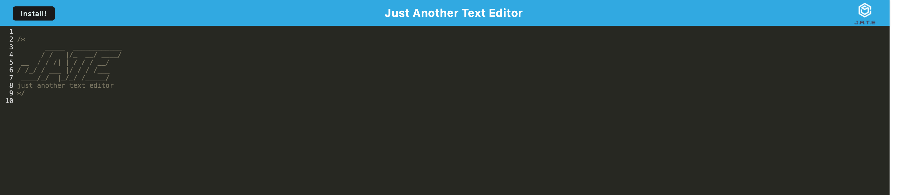

# text-editor-PWA-

## Description
The purpose of this project was to create a text editor that runs in the browser that also functions as a PWA. The application also features a number of data persistence techniques that serve as redundancy in the event one option is not supported. Primarily, IndexedDB was used. Lastly, the application will also function offline as well.

## Table of Contents
  - [Installation](#installation)
  - [Usage](#usage)
  - [Credits](#credits)
  - [License](#license)
  
## Installation
Just click install on the webpage preferably using google chrome.

## Usage
[DeyployedSite](https://jate-pwa-kc.herokuapp.com/)

## Credits   

N/A
 
## License

N/A

## Tests

N/A

## Questions
For additional projects my github username is [KoreyCollazo](https://github.com/KoreyCollazo)

If you have any questions or wish to contact me, please reach out to Koreycollazo@gmail.com. Thanks!

